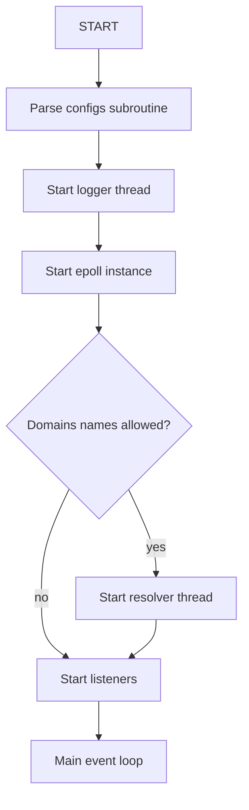
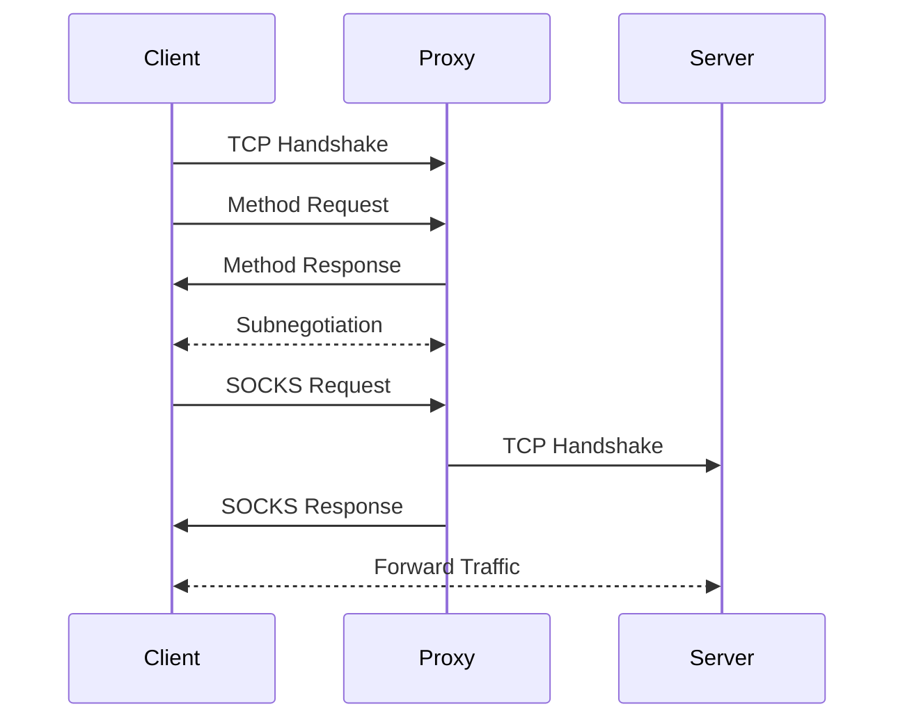
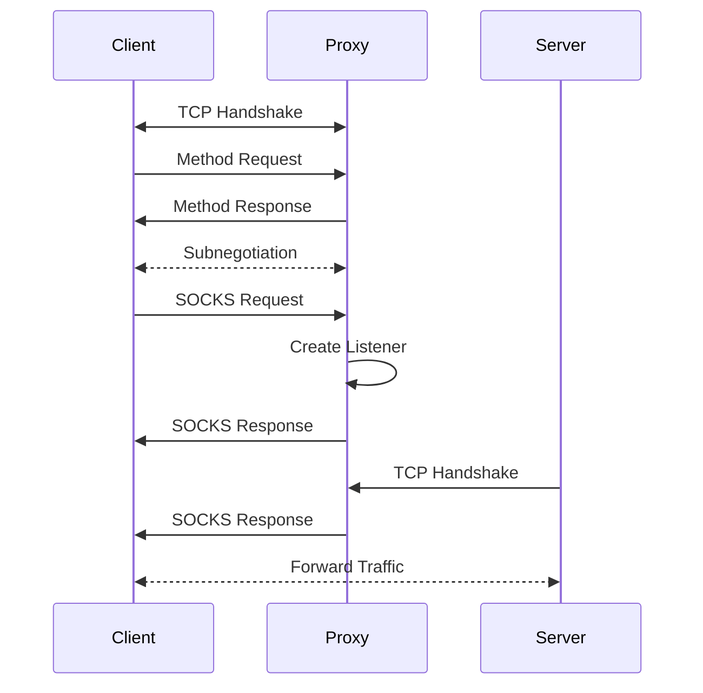
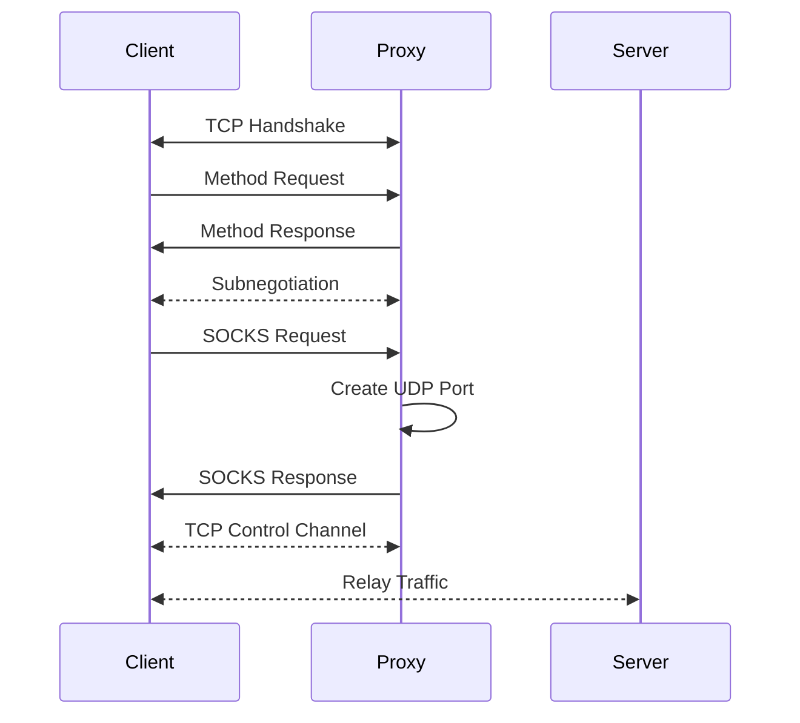

---

---

no state
resolver
listening
waiting methods
sending methods
authenticating
waiting command
async dns
sending reply
sending reply 2
connecting
bind listening
full
full udpa
half close
closed
