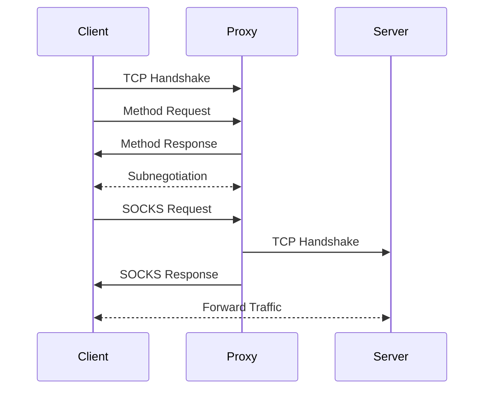
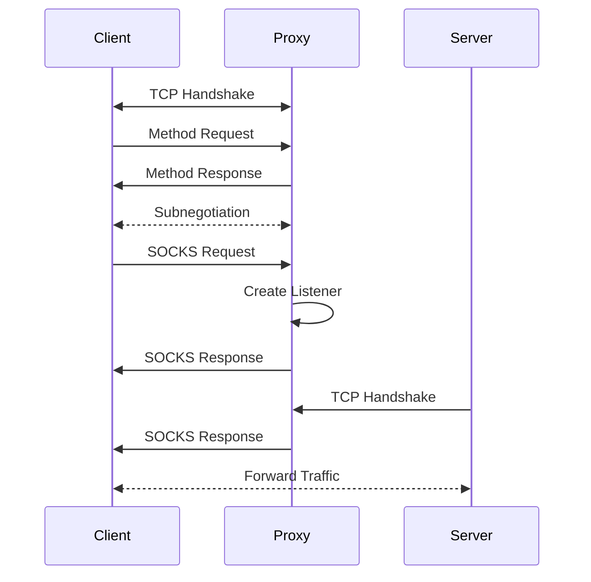
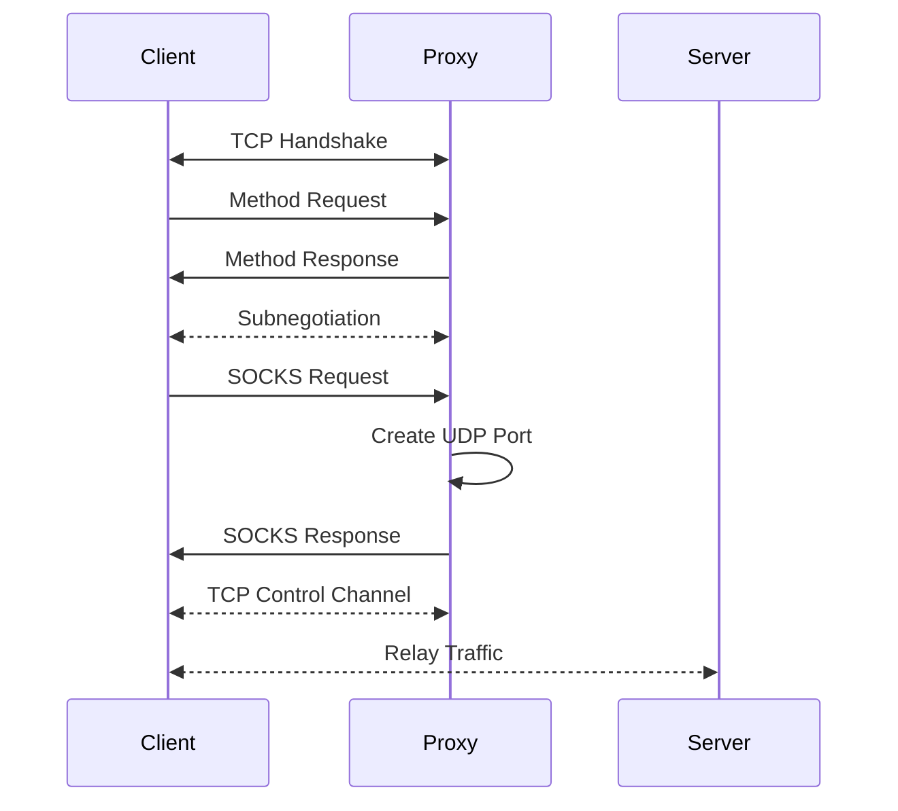

# Socksprox

 A socks5 server built for Linux in C.

## Table of Contents
- [Quick Install](#install)
- [Config File](#config)
- [Authentication Methods](#methods)
- [Logs](#logs)
- [The SOCKS Protocol](#socks)
  - [Handshake](#handshake)
  - [Commands](#commands)
    - [Connect](#connect)
    - [Bind](#bind)
    - [UDP Associate](#udpa)

## Quick Install
```bash
git clone github.com/qkewq/socksprox
cd socksprox
make
./install-script.sh
```

## Config File
The default config file location for socksprox is `/etc/socksprox.conf`, this can be changed by editing the value of `CONFIG_FILE` in `include/config.h` before running `make`.  The config parser follows most of the rules of ini.  Comments are lines whose first non-whitespace character is either a pound sign (#) or a semi-colon ";".  All leading and trailing whitespace is ignored.  Keys and values are separated by either white space " " or an equals sign "=".  Spaces around the equals sign are ignored.  There will often be more than one of the same key for ip addresses and methods, for example including both `listen = 0.0.0.0_1080` and `listen ::_1080` is valid.  See `socksprox.conf` for default values and explanations.

|Key|Value|Note|
|-|-|-|
|access-log|/path/to/file|Where logs about client access will be written|
|error-log|/path/to/file|Where error logs about the server itself will be written|
|listen|<ipv4\|v6_port>|The ip addresses and ports for the server to listen on|
|allow-domains|<yes\|no>|Allow clients to make reqeusts containing domain names|
|allow-connect|<yes\|no>|Allow clients to request the connect command|
|allow-bind|<yes\|no>|Allow clients to request the bind command|
|allow-udp-associate|<yes\|no>|Allow clients to request the udp associate command|
|bind-advertise-address|<ipv4\|v6>|The ip address to use in the reply to clients who request bind|
|bind-listen-address|<ipv4\|v6>|The ip address to actually listen on for the bind command|
|udp-advertise-address|<ipv4\|v6>|The ip address to use in the reply to clients who request udp associate|
|udp-listen-address|<ipv4\|v6>|The ip address to actually listen on for the udp associate command|
|max-connections|<integer\>|The maximum connection at one time on the server|
|method|<method\>|The allowable authentication methods for the socks handshake (see methods in this readme)|
|block|<ipv4\|v6>/mask|List of ip address in cidr notation that the server should refuse to connect to|

## Authentication Methods

|Name|Config Value|Note|
|-|-|-|
|No authentication|no-auth|No authentication required (currently the only method supported)|
|Username/Password|username-password|[RFC 1929](https://datatracker.ietf.org/doc/html/rfc1929) SOCKS authentication (not supported yet)|
|GSSAPI|gssapi|GSSAPI authentication (not supported)|

## Logs
Socksprox writes logs to two files by default, `/var/log/access.log` and `/var/log/error.log`.

Access logs have the format `yyyy-mm-dd-hh:mm:ss...erm work in progress`.  Access logs are generated by actions made by clients and the ensuing proxy connection.


Error logs have the format `yyyy-mm-dd-hh:mm:ss-LEVEL|MNEMONIC-Message`.  Error logs are generated by the server about itself, this includes INFO logs as well.

---

# The SOCKS Protocol

The SOCKS Version 5 Protocol is defined in [RFC 1928](https://datatracker.ietf.org/doc/html/rfc1928).  The standard defines the the SOCKS handshake as well as what commands can be sent to the server.  The registered port for SOCKS is `TCP:1080`.

## Handshake
Once the client has completed the TCP handshake with the server the SOCKS hand shake begins.  The `method request` is the first message sent to the server by the client.  The first byte is always `0x05` to represent SOCKS version 5.  The second byte specifies the number of bytes that will follow, between 1 and 255.  The following bytes are method specifier octets, these specify the authentication methods the client is requesting to use to connect to the server.  The defined methods are `0x00 No Authentication`, `0x01 GSSAPI`, and `0x02 Username\Password`.

The server inspects the requested methods and responds to this with a `method reply` message.  The first byte is `0x05` and the second byte is the method specifier of the selected method.  A reply 0f `0xff` indicates that the server found no acceptable methods and will close the connection.

Once the method is selected the client and server will enter a sub negotiation specific to the selected method or, in the case of `No Authentication`, move onto the next step in the handshake.

Once authenticated with the server, the client will send the `SOCKS Request` message.  The first byte is `0x05` like always, the second bytes denotes the command the client is requesting.  The commands are `0x01 Connect`, `0x02 Bind`, and `0x03 UDP Associate` (See [Commands](#commands)).  The third byte is reserved and always `0x00`.  The fourth byte is the address type of the following address, types are `0x01 IPv4`, `0x03 Domain Name`, and `0x04 IPv6`.  The next bytes are variable depending on the address type, for `IPv4` there are four bytes, for `IPv6` there are sixteen bytes, and for `Domain Name` the length is denoted by the first byte of the address field.  The last two bytes are the `port number` in network byte order.

The server then evaluates the command and chooses how to respond.  The `SOCKS Reply` message follows a similar format to the `SOCKS Request`.  The first byte is `0x05` followed by the `Response Code`, a code of `0x00` indicates success and anything else indicates failure with `0x01 - 0x09` being defined as specific failure codes.  If anything other than `0x00 Success` is sent in the reply the server will close the connection.  The next byte is reserved and always `0x00`.  The next byte is the address type similar to the requst message.  The following address and port combination depends on the command that was recieved by the server (See [Commands](#commands)).

## Commands

#### Connect
The `0x01 Connect` command instructs the server to initiate an outbound TCP connection to the address and port specified in the `SOCKS Request`.  If the connection fails the server will respond with the proper error code in the `SOCKS Reply`.  If a successful connection was made the `SOCKS Reply` will contain the address and port of the proxy side connection that was opened.



#### Bind
The `0x02 Bind` command instructs the server to create a listening socket on the proxy itself.  The address and port specified in the `SOCKS Reqeust` are expected to be the address and port of the server that will connect to the proxy on the listening socket.  For the bind command the proxy will send **two** `SOCKS Reply` messages.  The address and port specified in the first reply is the address and port of the listener that the target should connect to.  The second reply is sent once a connection has been established and contains the address and port of the connecting host.  This command is often used for protocols wherein a primary control channel has already been established and a second channel must be opened, notably `FTP Active Mode`.



#### UDP Associate
The `0x03 UDP Associate` instructs the server to open a UDP relay port.  The address and port specified in the `SOCKS Request` should be the address and port host the client expects to recieve traffic from, if the client does not know the information it can send an address and port of all zeros.  After creating the relay port the `SOCKS Reply` contains the address and port of the relay socket.  The UDP traffic between the client and proxy are wrapped in a `SOCKS UDP Header`.  The first two bytes are reserved and always set to `0x0000`.  The third byte indicates the `fragment number` of the packet.  Handling fragments is optional, if it is not implemented the fragment number must be `0x00`.  The fourth byte is the address type of the following address followed by the port number similar to the `SOCKS Request`.  Following the address and port is the UDP data being sent.

